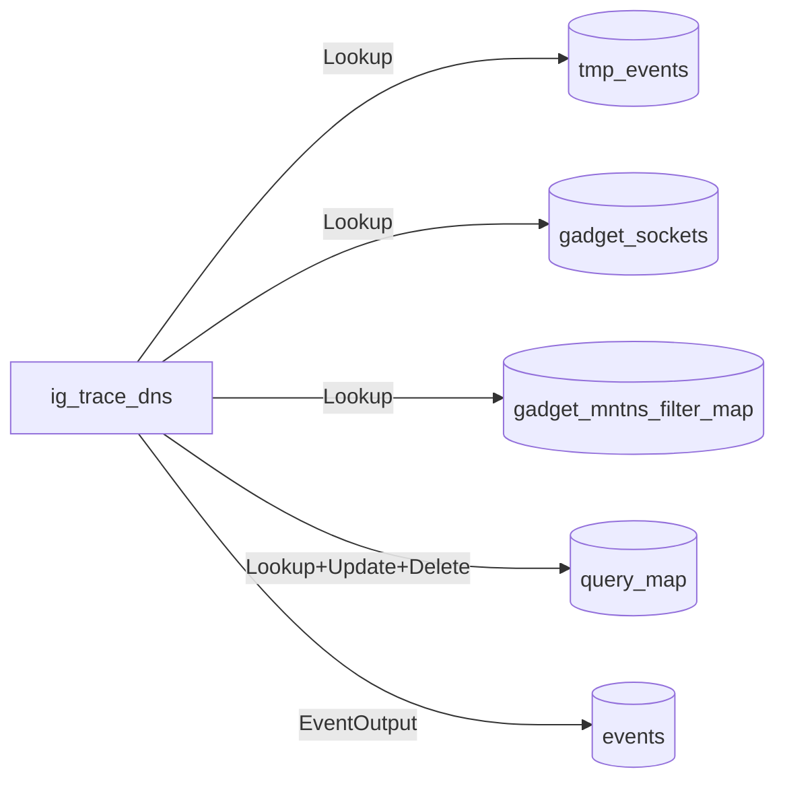
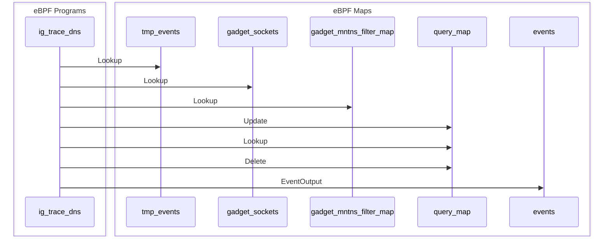

Hola amigos! I'm [Kapil Sareen](https://github.com/KapilSareen), a new inspektor in the community. For the past few months, I have been working under the mentorship of [Alban Crequy](https://github.com/alban/) and [Jose Blanquicet](https://github.com/blanquicet) as a part of the [LFX Mentorship](https://mentorship.lfx.linuxfoundation.org/project/a6d66c40-3d12-4fa4-88bf-18574f6b4ec0) program. 

This blog serves as a digital record and documentation of the work I have undertaken during the mentorship.

<!-- truncate -->

## The What, the Why, and the How-I-Did-It

The project focused on enhancing the `ig image inspect` command in [Inspektor Gadget](https://github.com/inspektor-gadget/inspektor-gadget), originally introduced in [PR #3382](https://github.com/inspektor-gadget/inspektor-gadget/pull/3382). While the initial implementation allowed basic inspection of gadget container images, it fell short of delivering the level of detail required by developers and maintainers for effective debugging and analysis.

When working with eBPF-based gadgets, having clear visibility into the gadget's sections, relocations, and program sources is critical. Before this enhancement, developers often had to rely on a mix of low-level tools (`readelf`, `objdump`, manual YAML parsing) to gather this information—leading to fragmented workflows and a steep learning curve.

The goal of this project was to transform `ig image inspect` into a comprehensive and developer-friendly tool for gadget introspection. With these enhancements, the command now delivers detailed insights into the OCI information, data sources with their fields, and eBPF parameters. It also provides in-depth inspection of the eBPF module, including ELF sections, eBPF maps, eBPF relocations, and disassembled bytecode annotated with source code when available. Additionally, the command surfaces relevant WASM module information such as WASM upcalls and the gadget API version. This powerful, single-command interface consolidates all essential gadget details—greatly improving visibility, simplifying debugging, and streamlining the development workflow.

In the following sections, I'll walk through the design, implementation details and key features.

### Architecture & Design

In my initial proposal, I suggested creating a dedicated go package for the `ig image inspect` command to be used client-side across all three Inspektor Gadget binaries—`ig`, `gadgetctl`, and `kubectl-gadget`. While this approach was clean and modular, it came with several limitations.

Ultimately, we took a different direction: we leveraged the operators framework to move the inspection logic server-side for the `ig` binary. For the other two clients, `gadgetctl` and `kubectl-gadget`, we updated the gRPC API and adapted them to interact with this new operator-based workflow.

One key advantage of this approach is that the `ig image inspect` command remains automatically in sync whenever a new operator is added for a specific gadget layer—making the system more maintainable and extensible in the long run.

### Deep Dive: Code Walkthrough

We chose to use the runtime's `GetGadgetInfo` function as the central place for handling all the additional information injected by operators. To avoid unnecessary data overload, especially when the extra info isn't needed, we introduced an `ExtraInfo` boolean within the `gadgetctx`. This flag is passed into the `GetGadgetInfo` function, ensuring that extra debug information is only included when explicitly requested.

Given that there are two types of runtimes — a [local](https://pkg.go.dev/github.com/inspektor-gadget/inspektor-gadget@main/pkg/runtime/local) one (used by `ig`) and a [gRPC](https://pkg.go.dev/github.com/inspektor-gadget/inspektor-gadget@main/pkg/runtime/grpc) one (used by `gadgetctl` and `kubectl-gadget`) — the gRPC implementation required additional effort to adapt the [API definition](https://github.com/inspektor-gadget/inspektor-gadget/blob/512e7d8db4130dcb60fdf464e5b6892e25d0510d/pkg/gadget-service/api/api.proto#L254) and correctly handle the new `ExtraInfo` field in client-server communication.

#### Local Runtime

In the local runtime, the only required change was to pass the `ExtraInfo` boolean into the `gadgetCtx.SerializeGadgetInfo` function:

```go
// pkg/runtime/local/oci.go

func (r *Runtime) GetGadgetInfo(gadgetCtx runtime.GadgetContext, runtimeParams *params.Params, paramValues api.ParamValues) (*api.GadgetInfo, error) {
	err := gadgetCtx.PrepareGadgetInfo(paramValues)
	if err != nil {
		return nil, fmt.Errorf("initializing and preparing operators: %w", err)
	}
	return gadgetCtx.SerializeGadgetInfo(gadgetCtx.ExtraInfo())
}
```

#### gRPC Changes

For the gRPC API, we first modified the protobuf file (`pkg/gadget-service/api/api.proto`) by adding a `requestExtraInfo` boolean to the `GetGadgetInfoRequest` message. This serves the same purpose as in the local runtime — toggling the inclusion of extra debugging information.

```proto
// pkg/gadget-service/api/api.proto

message GetGadgetInfoRequest {
  ...
  // Used to include additional debug information (e.g., in 'ig image inspect')
  bool requestExtraInfo = 5;
}
```

Next, we updated the `GadgetInfo` message to include an `ExtraInfo` field. This field is a map of strings to a flexible data structure called `GadgetInspectAddendum`. This approach avoids the need for multiple message types and makes the system adaptable to future fields without requiring protobuf changes.

```proto
// pkg/gadget-service/api/api.proto

message GadgetInfo {
  ...
  ExtraInfo extraInfo = 9;
}

message ExtraInfo {
  // Keys can be "wasm.upcalls", "ebpf.sections", etc.
  map<string, GadgetInspectAddendum> data = 1;
}

message GadgetInspectAddendum {
  // contentType could be application/json, text/plain, text/mermaid, text/markdown, etc.
  string contentType = 1;
  bytes content = 2;
}
```

#### Operator Changes

With the runtimes now capable of handling `ExtraInfo`, the next step was to generate this data within the operators themselves. This was implemented in the `init` function of each operator (e.g., `WASM`, `eBPF`, `oci-handler`). Below is an example from the `oci-handler` operator:

```go
// pkg/operators/oci-handler/oci.go

func (o *OciHandlerInstance) init(gadgetCtx operators.GadgetContext) error {
  ...
  // Add extra info if requested
  if gadgetCtx.ExtraInfo() {
      err := addExtraInfo(gadgetCtx, metadata, manifest)
      if err != nil {
          return fmt.Errorf("adding extra info: %w", err)
      }
  }
```

```go
// pkg/operators/oci-handler/extrainfo.go

func addExtraInfo(gadgetCtx operators.GadgetContext, metadata []byte, manifest *ocispec.Manifest) error {
	parsed, err := reference.Parse(gadgetCtx.ImageName())
	if err != nil {
		return err
	}

	var repository string
	if named, ok := parsed.(reference.Named); ok {
		repository = named.Name()
	}

	tag := "latest"
	if tagged, ok := parsed.(reference.Tagged); ok {
		tag = tagged.Tag()
	}

	digest := manifest.Config.Digest.String()
	created := manifest.Annotations[ocispec.AnnotationCreated]

	ociInfo := &api.ExtraInfo{
		Data: make(map[string]*api.GadgetInspectAddendum),
	}

	manifestJson, _ := json.Marshal(manifest)
	ociInfo.Data["oci.manifest"] = &api.GadgetInspectAddendum{
		ContentType: "application/json",
		Content:     manifestJson,
	}
	ociInfo.Data["oci.metadata"] = &api.GadgetInspectAddendum{
		ContentType: "text/yaml",
		Content:     metadata,
	}
	ociInfo.Data["oci.repository"] = &api.GadgetInspectAddendum{
		ContentType: "text/plain",
		Content:     []byte(repository),
	}
	ociInfo.Data["oci.tag"] = &api.GadgetInspectAddendum{
		ContentType: "text/plain",
		Content:     []byte(tag),
	}
	ociInfo.Data["oci.digest"] = &api.GadgetInspectAddendum{
		ContentType: "text/plain",
		Content:     []byte(digest),
	}
	ociInfo.Data["oci.created"] = &api.GadgetInspectAddendum{
		ContentType: "text/plain",
		Content:     []byte(created),
	}

	gadgetCtx.SetVar("extraInfo.oci", ociInfo)

	return nil
}
```

#### Serializing and Loading "Extra" Info in `GetGadgetInfo`

Once the "extra" info is stored in the `gadgetctx`, the final task is to serialize it — and in the case of gRPC clients, load it into the client-side `gadgetctx`.

```go
// pkg/gadget-context/gadget-context.go

func (c *GadgetContext) SerializeGadgetInfo(extraInfo bool) (*api.GadgetInfo, error) {
  ...
  if c.ExtraInfo() && extraInfo {
      gi.ExtraInfo = &api.ExtraInfo{
          Data: make(map[string]*api.GadgetInspectAddendum),
      }

      for k, v := range c.GetVars() {
          if !strings.HasPrefix(k, "extraInfo.") {
              continue
          }
          for key, val := range v.(*api.ExtraInfo).Data {
              gi.ExtraInfo.Data[strings.TrimPrefix(key, "extraInfo.")] = val
          }
      }
  }
  return gi, nil
}


func (c *GadgetContext) LoadGadgetInfo(info *api.GadgetInfo, paramValues api.ParamValues, run bool, extraInfo *api.ExtraInfo) error {
  ...
  if c.ExtraInfo() && extraInfo != nil {
      for k, v := range extraInfo.Data {
          // Key is in the form of "wasm.upcalls", "ebpf.sections", etc.
          prefix := strings.Split(k, ".")[0]
          ei, ok := c.GetVar("extraInfo." + prefix)
          if !ok {
              ei = &api.ExtraInfo{
                  Data: make(map[string]*api.GadgetInspectAddendum),
              }
              c.SetVar("extraInfo."+prefix, ei)
          }
          ei.(*api.ExtraInfo).Data[k] = v
      }
  }
  return nil
}
```

### UX Enhancements & Demo

There's a lot of useful data our command can show, but dumping it all at once isn't exactly user-friendly. To make things smoother and easier to navigate, we've added some handy feature flags that give you more control over what you see and how you see it:

```bash
  -o, --output         string   Output mode: json, jsonpretty, yaml (default "jsonpretty")
  --extra-info         string   Specify the particular information to retrieve
  --jsonpath           string   JSONPath expression to extract from the extra info
  --show-datasources   bool     Display datasources along with their available fields
```

In this section, we walk through a demonstration of these features. Since the raw output can be verbose, we utilize `jq` and our utility flags to cleanly extract and display meaningful insights.

---

**1. Extracting all available info keys using `jq`:**

```bash
$ sudo ig image inspect fsnotify | jq keys
[
  "ebpf.flowchart",
  "ebpf.maps",
  "ebpf.programs",
  "ebpf.sections",
  "ebpf.sequence",
  "ebpf.variables",
  "oci.created",
  "oci.digest",
  "oci.manifest",
  "oci.metadata",
  "oci.repository",
  "oci.tag",
  "wasm.gadgetAPIVersion",
  "wasm.upcalls"
]
```

---

**2. Using `--extra-info` to retrieve specific information:**

```bash
$ sudo ig image inspect audit_seccomp --extra-info=oci.manifest
{
  "annotations": {
    "io.inspektor-gadget.builder.version": "2c2099b",
    "org.opencontainers.image.created": "2025-04-17T16:05:34Z",
    "org.opencontainers.image.description": "Audit syscalls according to the seccomp profile",
    "org.opencontainers.image.documentation": "https://www.inspektor-gadget.io/docs/latest/gadgets/audit_seccomp",
    "org.opencontainers.image.source": "https://github.com/inspektor-gadget/inspektor-gadget/tree/main/gadgets/audit_seccomp",
    "org.opencontainers.image.title": "audit seccomp",
    "org.opencontainers.image.url": "https://inspektor-gadget.io/"
  },
  "artifactType": "application/vnd.gadget.v1+binary",
  "config": {
    "annotations": {
      "io.inspektor-gadget.builder.version": "2c2099b",
      ...
```

---

**3. Using `--jsonpath` for targeted data extraction:**

```bash
$ sudo ig image inspect advise_seccomp --extra-info=oci.manifest --jsonpath=".layers[*].mediaType" -o yaml
- application/vnd.gadget.ebpf.program.v1+binary
- application/vnd.gadget.wasm.program.v1+binary
```

---

**4. Displaying datasources and their fields:**

*Show all datasources:*

```bash
$ sudo ig image inspect audit_seccomp --show-datasources
[
  {
    "name": "seccomp",
    "type": 1,
    "fields": [
      {
        "name": "timestamp_raw",
        "fullName": "timestamp_raw",
        "size": 8,
        "flags": 20,
        "kind": 9,
        "tags": [
          "type:gadget_timestamp",
          "type:__u64",
          "type:unsigned long long",
          "name:timestamp_raw",
          "src:ebpf"
          ...
```

*List all field names of a datasource:*

```bash
$ sudo ig image inspect advise_seccomp --show-datasources --jsonpath='[0].fields[*].fullName'
[
  "mntns_id_raw",
  "syscalls",
  "k8s",
  "k8s.node",
  "k8s.namespace",
  "k8s.podName",
  "k8s.containerName",
  "k8s.hostnetwork",
  "k8s.podLabels",
  "k8s.owner",
  "k8s.owner.kind",
  "k8s.owner.name",
  "runtime",
  "runtime.containerName",
  "runtime.runtimeName",
  "runtime.containerId",
  "runtime.containerPid",
  "runtime.containerImageName",
  "runtime.containerImageDigest",
  "runtime.containerStartedAt"
]
```

### Visualizing with Mermaid Graphs

One of the coolest things we added to the `ig image inspect` command is support for [**Mermaid graphs**](https://github.com/mermaid-js/mermaid ). We wanted to give gadget developers an easy way to visualize how eBPF programs and maps interact under the hood—so we introduced two fields specifically for this: `ebpf.flowchart` and `ebpf.sequence`.

* `flowchart` shows which maps are accessed by which programs.
* `sequence` adds a timeline view, showing the order of interactions with those maps.

The sequence diagrams are still a work in progress—they're best-effort for now—but we're actively working to improve their accuracy and detail.

Here's an example from the `trace_dns` gadget, generated entirely using `ig image inspect`:

---
*Flowchart:*


*Sequence diagram:*

---
These visualizations can be a huge help when you're trying to understand or debug your gadgets. Just run the command and plug the output into any Mermaid-compatible renderer.


## What's Next?

Looking ahead, we're excited about the future of the `ig image inspect` command. One key goal is to deeply integrate it with [ig-desktop](https://github.com/inspektor-gadget/ig-desktop/), allowing users to visualize Mermaid graphs and access rich debugging information directly through a graphical interface. This integration is currently a work in progress, but it represents a major step toward making gadget introspection more intuitive and accessible.

## Conclusion

Reflecting on the past few months, this journey has been incredibly rewarding—not just in terms of technical growth, but also personal development. I've learned how to collaborate effectively, adapt to feedback, and thrive in a pseudo-corporate environment.

I'm sincerely grateful to my mentors and the Inspektor Gadget community for their guidance and support throughout this experience. It's been a fantastic ride, and I hope to continue contributing back to this amazing project in the future.

Happy inspekting!
